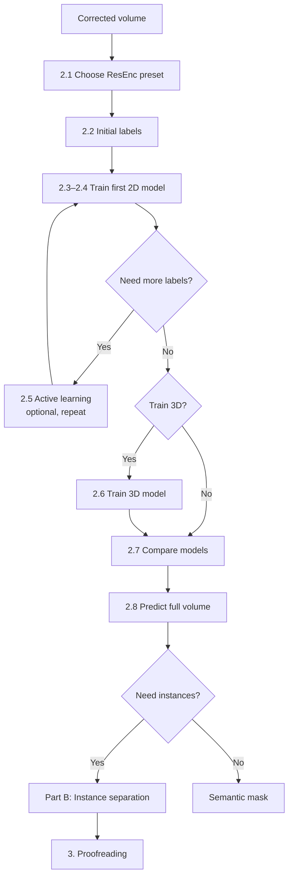

# 2. Segmentation

## Goal
Segment a target structure (our examples use mitochondria) in the corrected cryo-vEM dataset, in two parts:
1. **Semantic segmentation** with nnU-Net v2 [(Isensee et al., 2021)](https://github.com/MIC-DKFZ/nnUNet/tree/master): label every voxel as target or background.
2. **Instance segmentation** (optional): split the semantic mask into individual objects, each with its own ID. This step is necessary if you want to statistically analyze each instance of feature(s) of interest.

Training labels are built up iteratively: each model's predictions are corrected and used to train the next, better model. This keeps manual annotation to a minimum. Several steps are optional; use the decision guide below to choose a path for your data and hardware. Image filters that can make annotation easier are listed in [Part C](#part-c-filter-toolbox-optional) and can be added at several points in the workflow.

## Decision guide
| Decision | Options | Choose based on |
|---|---|---|
| [Network preset](#21-choose-a-preset) | ResEnc M/ L / XL | GPU memory |
| [Starting labels](#22-create-initial-labels) | Manual, or corrected predictions from a pretrained model | Whether a pretrained model works on your data |
| [Active learning](#25-optional-active-learning) | 0 to several rounds | Accuracy after the previous round |
| [Model dimension](#26-optional-train-a-3d-model) | 2D or 3D | Amount of labeled data, z-scale, GPU memory |
| [Filters](#part-c-filter-toolbox-optional) | None, or any from the toolbox, as viewing aids or preprocessing | Whether boundaries are faint, contrast is uneven, or data is noisy |
| [Instance separation](#part-b-instance-separation-optional) | Skip, connected components, or watershed | Whether you need individual objects and whether they touch | 



## Inputs
| Item | Format | Notes |
|---|---|---|
| Corrected volume | `.tif ` stack or `.mrc` | Output of [1. Artifact correction](01-artifact-correction.md) |
| Voxel size | (z, y, x) nm | Needed for 3D training and instance separation |

## Requirements, nnU-Net installation, and setup
Refer to nnU-Net's setup documentation [here](https://github.com/MIC-DKFZ/nnUNet/blob/master/documentation/getting-started/installation-and-setup.md).

## Part A: Semantic segmentation (nnU-Net v2)

### 2.1 Choose a preset
nnU-Net's residual encoder (ResEnc) presets set the patch and batch size to fit a GPU memory budget. Larger presets are usually more accurate but slower. Refer to nnU-Net's documentation for residual encoder types [here](https://github.com/MIC-DKFZ/nnUNet/blob/master/documentation/resenc_presets.md).<br>
Set your choice once as shell variables. All commands below use them, this example below uses the planner `nnUNetPlannerResEncM`:
```bash
PLANNER=nnUNetPlannerResEncM
PLANS=nnUNetResEncUNetMPlans
```
> **Other memory sizes.** To target a specific budget, for example an 80 GB GPU, use the selected ResEnc preset with a custom target and plans name. This example below uses the planner `nnUNetPlannerResEncL`:
> ```bash
> nnUNetv2_plan_and_preprocess -d <ID> -pl nnUNetPlannerResEncL \
>     -gpu_memory_target 80 -overwrite_plans_name nnUNetResEncUNetPlans_80G
> PLANS=nnUNetResEncUNetPlans_80G
> ```


### 2.2 Create initial labels
Choose one starting point:
**Option A: Manual labels (works for any target).**
1. Choose 20+ slices spread across the volume, covering different regions, cell / organelle types, and image quality. The more slices you manually label, the better the initial model does.
2. Annotate the target. You can use any software that has annotation capability that is available to you: softwares such as [ORS Dragonfly 3D World](https://dragonfly.comet.tech/), [Amira by Thermo Fisher](https://www.thermofisher.com/us/en/home/electron-microscopy/products/software-em-3d-vis/amira-software.html), [napari](https://napari.org/stable/).
3. Save each label image with the same size as its slice.

**Option B: Corrected predictions from a pretrained model.**
If a pretrained model already works reasonably on your data (for example, [MitoNet](https://pmc.ncbi.nlm.nih.gov/articles/PMC9883049/) for mitochondria), predict a set of slices with it and correct the errors in annotation software of choice. Correcting is usually much faster than annotating from scratch. Check a few predictions first: if most need to be redrawn, use Option A.

> **Tip:** Filtered versions of the image, such as CLAHE-enhanced or Frangi ridge layer, can make boundaries easier to see while annotating and also help the trained models to perform better.
> Label only slices you have fully checked. Unlabeled target pixels are learned as background.

### 2.3 Format the dataset
Refer to nnU-Net's documentation on formatting [here](https://github.com/MIC-DKFZ/nnUNet/blob/master/documentation/reference/dataset-format.md).

### 2.4 Train the first 2D model
You can start the training like for example,
```bash
nnUNetv2_plan_and_preprocess -d <ID> -pl $PLANNER --verify_dataset_integrity
nnUNetv2_train <ID> 2d 0 -p $PLANS
```
Refer to nnU-Net's documentation for training your first model [here](https://github.com/MIC-DKFZ/nnUNet/blob/master/documentation/how-to/train-models.md). 
> **Train/validation split.** By default, nnU-Net splits cases randomly into 5 folds. Neighboring FIB-SEM slices are nearly identical, so a random split puts near-duplicates in both training and validation and inflates validation scores. Before training, create `splits_final.json` in `$nnUNet_preprocessed/Dataset<ID>_<Name>/` so that slices from the same region of the volume stay in the same fold.

### 2.5 (Optional) Active learning
Instead of labeling random slices, target the slices where the current model is weakest.
1. Predict the volume and save probabilities:
   ```bash
   nnUNetv2_predict -i <input_dir> -o <output_dir> -d <ID> -c 2d -f 0 -p $PLANS --save_probabilities
   ```
   Further refer to nnU-Net's documentation on running inference [here](https://github.com/MIC-DKFZ/nnUNet/blob/master/documentation/how-to/run-inference.md).
2. Select slices to correct. Good candidates have many uncertain pixels (probabilities near 0.5), visible errors, or regions underrepresented in training.
3. Correct them, add them to the dataset, and retrain.

Repeat until accuracy on held-out slices stops improving. In practice, 1–3 rounds are usually enough.

### 2.6 (Optional) Train a 3D model
A 3D model uses context between slices, which helps when objects run through many slices.

**Train 3D if** you have labeled sub-volumes (consecutive labeled slices), the z-spacing is not much coarser than the xy pixel size, and your GPU fits at least ResEnc M. **Stay with 2D if** labels are scattered single slices, or z-resolution is much worse than xy.
```bash
nnUNetv2_plan_and_preprocess -d <ID_3D> -pl $PLANNER --verify_dataset_integrity
nnUNetv2_train <ID_3D> 3d_fullres 0 -p $PLANS
```

### 2.7 Compare models
Evaluate every model on a held-out test region that was never used for training or validation. Metrics such as Dice Similarity Score, precision, and recall are most commonly used.

### 2.8 Predict the full volume
```bash
nnUNetv2_predict -i <input_dir> -o <output_dir> -d <ID> -c <2d|3d_fullres> -f 0 -p $PLANS
```
nnU-Net's documentation on running inference is [here](https://github.com/MIC-DKFZ/nnUNet/blob/master/documentation/how-to/run-inference.md). <br>

If the model was trained on filtered images, filter the input volume with the same filters and parameters first.

Output: a semantic mask (`0 = background`, `1 = target`). Prediction also runs on GPUs smaller than those needed for training. It runs on CPU too, but very slowly.

## Part B: Instance separation (optional)

**Skip this part** if you only need volume fractions or overall coverage. **Use it** if you need to count, measure, or track individual objects.

### 2.9 Connected components
Assigns one ID to each group of connected voxels. **This is enough if** objects rarely touch each other.

ORS Dragonfly or Amira has this capability. If those are unavailable to you, you can script it like:
```python
import numpy as np
import tifffile
from scipy import ndimage as ndi

mask = tifffile.imread("semantic_mask.tif") > 0

# Remove objects smaller than min_size voxels (set below your smallest real object)
min_size = 500
instances, _ = ndi.label(mask)
sizes = np.bincount(instances.ravel())
small = sizes < min_size
small[0] = False
mask[small[instances]] = False

instances, n = ndi.label(mask)
print(f"{n} objects")
```

### 2.10 Watershed for touching objects

**Use this if** touching objects are merged into one component. A watershed on the Euclidean distance transform (EDT) cuts merged objects at their constrictions.

ORS Dragonfly or Amira has this capability. If those are unavailable to you, you can script it like:
```python
from skimage.feature import peak_local_max
from skimage.segmentation import watershed

voxel_size = (TODO, TODO, TODO)   # (z, y, x) in nm
edt = ndi.distance_transform_edt(mask, sampling=voxel_size)

# One seed per object at local maxima of the EDT
# exclude_border=False keeps objects that touch the edge of the volume
coords = peak_local_max(edt, min_distance=10, labels=instances, exclude_border=False)
markers = np.zeros(mask.shape, dtype=np.int32)
markers[tuple(coords.T)] = np.arange(1, len(coords) + 1)

instances = watershed(-edt, markers, mask=mask)
tifffile.imwrite("instances.tif", instances.astype(np.uint32))
```
`min_distance` (in voxels) controls how readily objects are split. Start near the radius of a typical object and adjust:

| Symptom | Adjustment |
|---|---|
| Single objects split into several (oversegmentation) | Raise `min_distance` |
| Touching objects still merged (undersegmentation) | Lower `min_distance` |
| Long, thin objects fragmented | Raise `min_distance`, or apply watershed only to components above a size threshold and keep the rest from 2.9 |

No setting is perfect for every object; remaining errors are fixed in [3. Proofreading](03-proofreading.md).

## Part C: Filter toolbox (optional)
These filters can make segmentation easier by raising contrast at boundaries, highlighting membranes, or reducing noise. None are required. Try them on a few slices, and keep only what visibly helps.
### How to use filters

There are two ways to use a filter, with different rules:

| Use | How | Rule |
|---|---|---|
| **Viewing aid** | Add the filtered image as an extra layer in napari while annotating or proofreading | Free to use anywhere; it doesn't affect the model |
| **Preprocessing** | Train and predict on filtered images instead of, or in addition to, the original | Apply the **same filters with the same parameters** to training images and every volume you predict |

A model trained on filtered images performs poorly on unfiltered ones, and vice versa. Record the filters and parameters with each trained model.

**Filtered image as an extra channel.** Instead of replacing the original, you can give nnU-Net both: the original as channel 0 and a filter output as channel 1. The model then learns how much to rely on each. Save the filter output as `<case>_0001.tif` next to `<case>_0000.tif`, and list both channels in `dataset.json`:

```json
"channel_names": {"0": "EM", "1": "Frangi"}
```
Apply filters after [1. Artifact correction](01-artifact-correction.md); most of them also amplify noise and any remaining stripes. When preprocessing whole volumes, filter in 3D where possible. Filtering each slice on its own can give the same structure different values in neighboring slices, which shows up as banding in XZ/YZ views.

### Overview
| Filter | Category | What it does | Helps when | Watch out for |
|---|---|---|---|---|
| [CLAHE](#clahe) | Contrast | Equalizes contrast in local tiles, with a limit on amplification | Faint boundaries; uneven contrast within or between slices | Amplifies noise and residual stripes if the clip limit is too high |
| [Global histogram equalization](#global-histogram-equalization) | Contrast | Spreads intensities over the full range | Low overall contrast with even illumination | Can over-brighten background; ignores local differences |
| [Percentile contrast stretch](#percentile-contrast-stretch) | Contrast | Linearly maps low and high percentiles to the full range | A gentle, predictable contrast boost | Doesn't fix uneven contrast |
| [Histogram matching](#histogram-matching) | Contrast | Matches intensities to a reference volume | Applying a trained model to a new sample or session | The reference should contain similar structures |
| [Frangi](#ridge-filters-frangi-sato-meijering) | Ridge | Enhances tube- and sheet-like ridges | Thin membranes; neighboring objects merging | Slow; strong response on any line-like feature |
| [Sato](#ridge-filters-frangi-sato-meijering) | Ridge | Enhances ridges, with a smoother response than Frangi | Continuous membranes | Can blur closely spaced membranes |
| [Meijering](#ridge-filters-frangi-sato-meijering) | Ridge | Enhances thin, branching lines | Very thin or faint boundaries | Sensitive to noise |
| [Median](#denoising-filters) | Denoising | Replaces each pixel with the median of its neighborhood | Salt-and-pepper or shot noise | Removes structures smaller than the window |
| [Gaussian](#denoising-filters) | Denoising | Smooths with a Gaussian kernel | Fine-grained noise | Blurs edges |
| [Non-local means](#denoising-filters) | Denoising | Averages similar patches across the image | Strong noise, keeping edges | Slower; can smooth fine texture |
| [Bilateral](#denoising-filters) | Denoising | Smooths while preserving strong edges | Noise with clear boundaries | Can create flat, cartoon-like regions |

ORS Dragonly and Amira may have similar filters that you can compare visually faster. If unavailable, you can script it using scikit-image and SciPy. All examples of filters below can be used after this initial part:
```python
import numpy as np
import tifffile
from scipy import ndimage as ndi
from skimage import exposure, filters, restoration

vol = tifffile.imread("corrected_volume.tif")       # (z, y, x)
img = vol[100]                                       # one slice, for testing

def to_uint16(x):
    """Rescale a [0, 1] float image to uint16 for saving."""
    return np.round(np.clip(x, 0, 1) * 65535).astype(np.uint16)
```

#### CLAHE
Contrast-limited adaptive histogram equalization (Zuiderveld, 1994).
```python
# 3D (recommended for volumes); tile size per axis (z, y, x), z scaled by anisotropy
out = to_uint16(exposure.equalize_adapthist(vol, kernel_size=(8, 64, 64), clip_limit=0.01))

# 2D, slice by slice: less memory, but can cause slice-to-slice banding
out = to_uint16(np.stack([exposure.equalize_adapthist(s, kernel_size=64, clip_limit=0.01) for s in vol]))
```
| Parameter | Effect | Starting point |
|---|---|---|
| `kernel_size` | Tile size. Smaller tiles boost local contrast more but amplify noise. | About 1/8 of the image width, or a few times the target size |
| `clip_limit` | Limits amplification (0–1). Higher is stronger, with more noise. | 0.01; try 0.005–0.03 |

#### Global histogram equalization
```python
out = to_uint16(exposure.equalize_hist(vol))
```

#### Percentile contrast stretch
```python
lo, hi = np.percentile(vol, (0.5, 99.5))
out = to_uint16(exposure.rescale_intensity(vol.astype(np.float32), in_range=(lo, hi), out_range=(0, 1)))
```

#### Histogram matching
```python
reference = tifffile.imread("reference_volume.tif")   # e.g. a training volume
out = exposure.match_histograms(vol, reference).astype(vol.dtype)
```

### Ridge filters (Frangi, Sato, Meijering)
Ridge filters respond to line- or sheet-like structures at chosen widths, such as membranes, and output a ridge-strength map. They are most useful as a **viewing aid** for fixing boundaries and splitting merged objects, or as an **extra channel**. The ridge map alone usually loses too much information to replace the original image.
```python
img_f = img.astype(np.float32)

# sigmas: ridge widths to detect, in pixels (about half the membrane thickness)
# black_ridges: True if membranes are darker than their surroundings
frangi = filters.frangi(img_f, sigmas=[1, 2, 3], black_ridges=True)
sato = filters.sato(img_f, sigmas=[1, 2, 3], black_ridges=True)
meijering = filters.meijering(img_f, sigmas=[1, 2, 3], black_ridges=True)
```

All three also accept 3D volumes. Tune `sigmas` and `black_ridges` on one slice until the membranes stand out. View the result in ORS Dragonfly, Amira, or napari next to the image and predictions.

For napari:
```python
import napari

viewer = napari.Viewer()
viewer.add_image(img, name="EM")
viewer.add_image(frangi, name="Frangi", colormap="magma", blending="additive", visible=False)
viewer.add_labels(tifffile.imread("slice_prediction.tif"), name="prediction")
napari.run()
```

### Denoising filters
Denoising before a contrast or ridge filter keeps those filters from amplifying noise.
```python
img_f = img.astype(np.float32) / img.max()

median = ndi.median_filter(img_f, size=3)
gaussian = filters.gaussian(img_f, sigma=1)

noise = restoration.estimate_sigma(img_f)
nlm = restoration.denoise_nl_means(img_f, h=0.8 * noise, patch_size=5,
                                   patch_distance=6, fast_mode=True)
bilateral = restoration.denoise_bilateral(img_f, sigma_color=0.05, sigma_spatial=2)
```

| Filter | Main parameter | Starting point |
|---|---|---|
| Median | `size`: window width in pixels | 3 or 5 |
| Gaussian | `sigma`: blur width in pixels | 0.5–1 |
| Non-local means | `h`: filtering strength | 0.6–1.0 × estimated noise |
| Bilateral | `sigma_color`: intensity difference that still gets smoothed | 0.02–0.1 |

### Choosing and testing filters
1. Start with no filters, and add one only if you see a specific problem it addresses.
2. Compare settings side by side in napari, including XZ/YZ views. Look for clearer boundaries without grainy background, new stripes, or banding.
3. To confirm a filter helps segmentation, train the same configuration with and without it and compare metrics on the held-out region ([2.7](#27-compare-models)).

## Outputs
- `semantic_mask.tif`: binary mask from nnU-Net
- `instances.tif` (if Part B is used): instance labels, `uint32`, one ID per object
- Trained models in `$nnUNet_results`

## References
- Isensee F, Jaeger PF, Kohl SAA, Petersen J, Maier-Hein KH (2021). nnU-Net: a self-configuring method for deep learning-based biomedical image segmentation. *Nature Methods* 18:203–211.
- Isensee F, et al. (2024). nnU-Net Revisited: A Call for Rigorous Validation in 3D Medical Image Segmentation. *MICCAI 2024*.
- Frangi AF, Niessen WJ, Vincken KL, Viergever MA (1998). Multiscale vessel enhancement filtering. *MICCAI 1998*, LNCS 1496:130–137.
- Zuiderveld K (1994). Contrast limited adaptive histogram equalization. In *Graphics Gems IV*, Academic Press, 474–485.
- Conrad R, Narayan K (2023). Instance segmentation of mitochondria in electron microscopy images with a generalist deep learning model trained on a diverse dataset. *Cell Systems* 14(1):58–71.
- napari contributors (2019). napari: a multi-dimensional image viewer for python. doi:10.5281/zenodo.3555620
- Comet Technologies Canada Inc. (2025). Dragonfly 3D World (Version 2025.1) [Computer software]. https://dragonfly.comet.tech/

---
**Previous step:** [1. Artifact correction](01-artifact-correction.md) · **Next step:** [3. Proofreading](03-proofreading.md)
